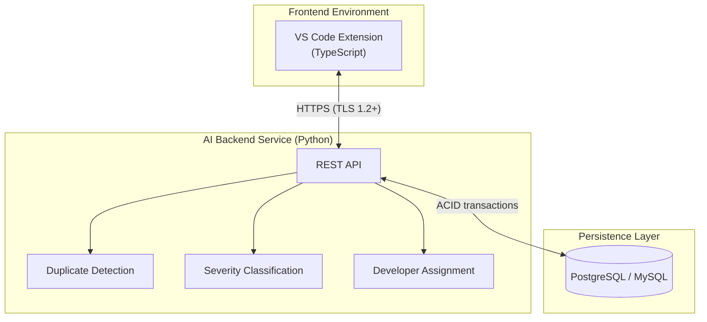
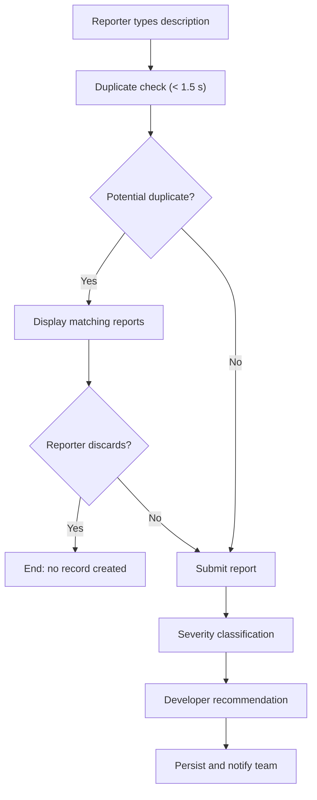
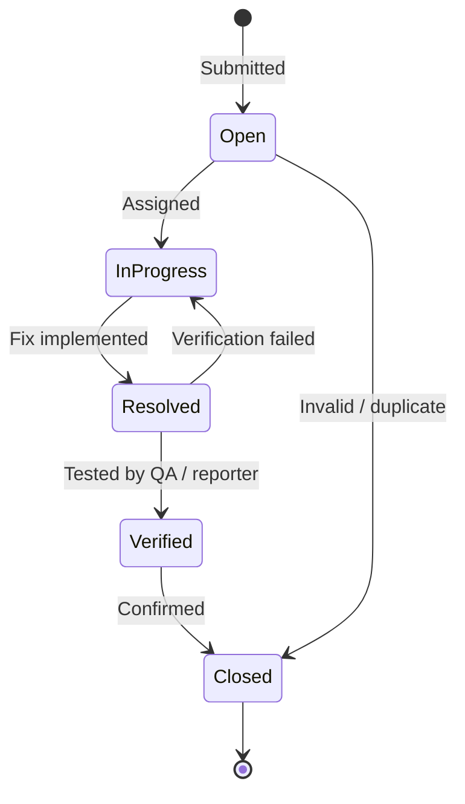

# AI-Powered Bug Tracking System

[](#project-status)
[](#architecture)
[](#technology-stack)
[](#quality-attributes)
[](#license)

A Visual Studio Code extension that automates bug triage by combining real-time duplicate detection, severity classification, and developer assignment into a single AI pipeline.

Developed as a Software Engineering capstone project at the College of Engineering, Al Ain University, UAE.

---

## Table of Contents

- [Background](#background)
- [Key Features](#key-features)
- [Architecture](#architecture)
- [Triage Pipeline](#triage-pipeline)
- [AI Components](#ai-components)
- [Bug Lifecycle](#bug-lifecycle)
- [Technology Stack](#technology-stack)
- [Requirements](#requirements)
- [Quality Attributes](#quality-attributes)
- [Datasets and Evaluation](#datasets-and-evaluation)
- [Repository Structure](#repository-structure)
- [Getting Started](#getting-started)
- [Project Status](#project-status)
- [Standards and Compliance](#standards-and-compliance)
- [Scope](#scope)
- [Team](#team)
- [Acknowledgements](#acknowledgements)
- [References](#references)
- [License](#license)

---

## Background

Bug triage requires three decisions for every incoming report:

1. Is it a duplicate of an existing report?
2. How severe is it?
3. Which developer should resolve it?

In most organizations these decisions are made manually, which does not scale. Published studies report that 10–30% of incoming reports in large projects are duplicates, and misassigned reports are frequently reassigned multiple times before resolution (bug tossing).

Prior research has addressed each task individually, validated offline on historical data. This project integrates all three into a deployable system with shared state between modules, real-time latency constraints, and the application infrastructure required for production use.

---

## Key Features

- **Real-time duplicate detection** while the reporter is typing, before the report is stored
- **Automatic severity classification** into Low, Medium, High, and Critical
- **Developer assignment recommendations** ranked by historical resolution data
- **Full bug lifecycle management** with status workflow and audit trail
- **Role-based access control** for Reporters, Developers, and Project Managers
- **Project dashboards** with bug trends and resolution-time metrics
- **Email and in-app notifications** for assignment, status, and critical-severity events
- **Graceful degradation** when the AI service is unavailable

---

## Architecture



**Design rationale**

| Decision | Reason |
|:--|:--|
| Frontend as a VS Code extension | Removes context switching; no additional tooling for teams |
| AI inference on a separate backend | The VS Code runtime cannot host heavy model inference |
| Stateless backend | Enables horizontal scaling behind a load balancer |
| Relational database | ACID guarantees for bug records, audit logs, and user data |
| Minimal data transmission | Only report text and metadata are sent; source code is never uploaded |

---

## Triage Pipeline



Outputs of earlier stages (duplicate status, severity) are passed as inputs to later stages, so the modules share state rather than operating independently.

---

## AI Components

| Component | Approach | Output | Target |
|:--|:--|:--|:--|
| Duplicate Detection | Two-phase: BM25 retrieval followed by semantic similarity re-ranking | Up to 3 candidate matches with similarity score | Recall@5 > 80% |
| Severity Classification | TF-IDF features with SVM / Random Forest / Naive Bayes voting ensemble | Low, Medium, High, Critical | Accuracy ≥ 85% |
| Developer Assignment | CNN-LSTM trained on historical assignment data | Top 3 ranked developers | ≥ 20% reduction in reassignments vs. random baseline |

**Model selection.** Lightweight, CPU-friendly models were chosen over transformer and LLM alternatives. The literature review found the accuracy difference (roughly 5–10 points) does not justify GPU infrastructure for a system with sub-second latency requirements.

**Human oversight.** Developers and Project Managers can override severity. Project Managers make the final assignment decision. All overrides are recorded in the audit trail.

---

## Bug Lifecycle



Each transition is restricted to authorized roles and logged with timestamp and actor.

---

## Technology Stack

| Layer | Technology |
|:--|:--|
| Client | VS Code Extension API, TypeScript |
| Backend | Python, Flask or FastAPI |
| Machine Learning | scikit-learn (TF-IDF, SVM, RF, NB), BM25, semantic similarity model, CNN-LSTM |
| Database | PostgreSQL or MySQL |
| API Specification | OpenAPI 3.0 |

---

## Requirements

The full specification defines **19 functional requirements**, **14 non-functional requirements**, and **5 design constraints**.

<details>
<summary><strong>Functional requirements (FR-01 – FR-19)</strong></summary>

| ID | Requirement | Area | Priority |
|:--|:--|:--|:--|
| FR-01 | Registration | User Management | High |
| FR-02 | Authentication | User Management | High |
| FR-03 | Role-Based Access Control | User Management | High |
| FR-04 | Profile Management | User Management | Medium |
| FR-05 | Bug Submission Form | Bug Lifecycle | High |
| FR-06 | Bug Status Lifecycle | Bug Lifecycle | High |
| FR-07 | Search and Filtering | Bug Lifecycle | High |
| FR-08 | Audit Trail | Bug Lifecycle | High |
| FR-09 | Comments | Bug Lifecycle | Medium |
| FR-10 | Real-Time Duplicate Detection | AI Features | High |
| FR-11 | Automatic Severity Classification | AI Features | High |
| FR-12 | Developer Assignment Recommendations | AI Features | High |
| FR-13 | Persistent Storage | Data Storage | High |
| FR-14 | Attachment Management | Data Storage | Medium |
| FR-15 | Project Dashboard | Data Storage | Medium |
| FR-16 | Email Notifications | Notifications | Medium |
| FR-17 | In-App Alerts | Notifications | Medium |
| FR-18 | Project Management | Administration | High |
| FR-19 | Team Membership | Administration | High |

</details>

<details>
<summary><strong>Design constraints (DC-01 – DC-05)</strong></summary>

| ID | Constraint | Technology / Standard |
|:--|:--|:--|
| DC-01 | VS Code Extension API compliance | TypeScript / JavaScript |
| DC-02 | AI inference offloaded to dedicated backend | Flask / FastAPI, REST |
| DC-03 | No source code transmitted externally | GDPR, UAE data protection law |
| DC-04 | Relational database with ACID transactions | PostgreSQL / MySQL |
| DC-05 | REST API documented before acceptance testing | OpenAPI 3.0 |

</details>

---

## Quality Attributes

| ID | Attribute | Requirement |
|:--|:--|:--|
| NFR-01 | Performance | Page load ≤ 2 s at 100 concurrent users |
| NFR-02 | Performance | Duplicate detection and severity ≤ 1.5 s; assignment ≤ 3 s |
| NFR-03 | Performance | 50 concurrent submissions with < 10% latency degradation |
| NFR-04 | Security | Passwords stored as salted bcrypt hashes |
| NFR-05 | Security | TLS 1.2+ for all client-server traffic |
| NFR-06 | Security | Authorization enforced at the API layer (HTTP 403) |
| NFR-07 | Security | Server-side validation against SQLi, XSS, path traversal |
| NFR-08 | Scalability | Stateless backend with connection pooling |
| NFR-09 | Reliability | 99% availability during business hours |
| NFR-10 | Reliability | Submissions succeed when AI service is down (severity: Unclassified) |
| NFR-11 | Usability | First bug report within 5 minutes of registration |
| NFR-12 | Accessibility | WCAG 2.1 Level AA |
| NFR-13 | Maintainability | ≥ 70% backend test coverage; full OpenAPI 3.0 spec |
| NFR-14 | Maintainability | Thresholds configurable without redeployment |

---

## Datasets and Evaluation

**Datasets**

| Dataset | Size | Purpose |
|:--|:--|:--|
| Eclipse Bugzilla | 380,000+ reports (2001–2012) | Primary training set for severity and assignment |
| Mozilla Firefox Bugzilla | ~550,000 reports | Out-of-distribution evaluation for assignment |
| Meng et al. (2024) benchmark | Maintainer-verified duplicate pairs | Duplicate detection evaluation |

**Evaluation methodology**

| Component | Metrics | Protocol |
|:--|:--|:--|
| Severity | Accuracy, macro/weighted Precision, Recall, F1, confusion matrix | 80/20 split, 10-fold CV for tuning |
| Duplicates | Recall@1/5/10, MRR, Average Precision | Benchmark comparison against [13], [16] |
| Assignment | Top-1/3/5 Accuracy, Mean Number of Reassignments | Held-out Eclipse test set, Mozilla generalization |
| System | End-to-end latency, task completion time | Load test at 50 users, usability study (n = 5) |

---

## Repository Structure

> Planned layout. Subject to change during implementation.

```
.
├── extension/          # VS Code extension (TypeScript)
├── backend/            # REST API service (Python)
│   ├── api/
│   ├── services/
│   └── tests/
├── ml/                 # Model training, evaluation, and artifacts
│   ├── duplicate/
│   ├── severity/
│   └── assignment/
├── docs/               # Report, diagrams, OpenAPI specification
└── README.md
```

---

## Getting Started

> Installation and usage instructions will be published once implementation begins in Capstone II.

**Prerequisites (planned)**

- Visual Studio Code
- Node.js (LTS)
- Python 3.10+
- PostgreSQL or MySQL

---

## Project Status

The project follows an Agile process with one- to two-week sprints across two semesters.

| Phase | Period | Status |
|:--|:--|:--|
| Domain study and literature review | Jan – Mar 2026 | Complete |
| Requirements specification | Apr 2026 | Complete |
| Capstone I presentation | May 2026 | Complete |
| System design and architecture | Sep 2026 | In progress |
| Implementation and AI integration | Oct – Nov 2026 | Planned |
| Testing and validation | Nov – Dec 2026 | Planned |
| Final documentation and presentation | Dec 2026 | Planned |

---

## Standards and Compliance

| Standard | Application |
|:--|:--|
| IEEE 830 | Software requirements specification |
| IEEE 1220 | Systems engineering process |
| ISO/IEC 12207 | Software lifecycle processes |
| WCAG 2.1 Level AA | Accessibility |
| GDPR, UAE Data Protection Law | Handling of personal data and report content |

---

## Scope

**In scope:** bug reporting, triage, tracking, and analysis within the IDE.

**Out of scope:**

- Replacing GitHub or GitLab as a project management platform
- Automated code generation or bug fixing

---

## Team

| Name | Role |
|:--|:--|
| Yaser Safar | Developer |
| Mohammed Naser AlOthmanli | Developer |
| Mohammed Abdullatif Saleh | Developer |
| Mohammed Jamal Abu Safat | Developer |

**Supervisor:** Dr. Noor Aldeen Alawad

---

## Acknowledgements

We thank Dr. Saqib Iqbal, Dr. Issam Al Azzoni, Prof. Zina Houhamdi, and Dr. Ayman Odeh, and the College of Engineering at Al Ain University for their guidance and support.

---

## References

Selected sources. The complete bibliography (20 works) is available in the project report.

1. N. Adhikari, R. Bista, and S. Sigdel, "Leveraging machine learning for enhanced bug triaging in open-source software projects," *IEEE Access*, 2025.
2. R. Bocu, A. Baicoianu, and A. Kerestely, "An extended survey concerning the significance of artificial intelligence and machine learning techniques for bug triage and management," *IEEE Access*, vol. 11, 2023.
3. S. Mani, A. Sankaran, and R. Aralikatte, "DeepTriage: Exploring the effectiveness of deep learning for bug triaging," arXiv:1801.01275, 2018.
4. Q. Meng, X. Zhang, G. Ramackers, and J. Visser, "Combining retrieval and classification: Balancing efficiency and accuracy in duplicate bug report detection," arXiv:2404.14877, 2024.
5. M. Namdar, F. Barzinpour, R. Noorossana, and M. Saidi-Mehrabad, "Automated software bug severity classification using ensemble machine learning scheme: A real case study," *PLOS ONE*, vol. 20, no. 10, 2025.
6. I. Pikh et al., "Detecting duplicates in bug tracking systems with artificial intelligence: A combined retrieval and classification approach," *Applied Sciences*, vol. 16, no. 1, 2025.
7. U. B. Torun, M. T. Demircan, M. F. Gön, and E. Tüzyün, "Past, present, and future of bug tracking in the generative AI era," arXiv:2510.08005, 2025.

---

## License

Copyright © 2026 Yaser Safar, Mohammed Naser AlOthmanli, Mohammed Abdullatif Saleh, Mohammed Jamal Abu Safat.

All rights reserved. This work is subject to the Intellectual Property Policy of Al Ain University. Use of any material from this repository requires appropriate acknowledgement.
